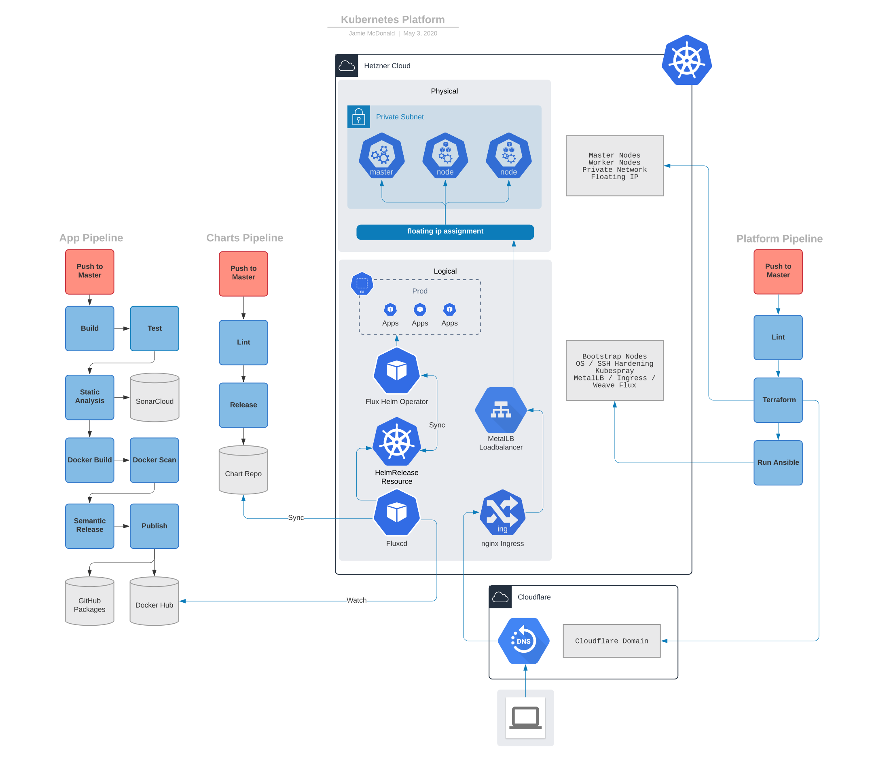

# Kubernetes Platform Setup 

## Overview

A set of Ansible & Terraform scripts to manage and deploy a Kubernetes platform to [Hetzner Cloud](https://www.hetzner.com/cloud).

Deploys Kubernetes onto a three node cluster, sets up DNS to point to the cluster, and deploys the [Weave Flux](https://github.com/fluxcd/flux) [Helm Operator](https://github.com/fluxcd/helm-operator-get-started) to manage GitOps deployments of applications to the cluster. 

HelmReleases are managed in the [jrmcdonald/helm-charts](https://github.com/jrmcdonald/helm-charts) repository.



## Requirements

* [Terraform](https://www.terraform.io/)
* [Ansible](https://www.ansible.com/)
* [GnuPG](https://gnupg.org/)
* [Kubectl](https://kubernetes.io/docs/tasks/tools/install-kubectl/)
* [Helm](https://helm.sh/)
* [fluxctl](https://docs.fluxcd.io/en/1.17.1/references/fluxctl.html)

## Manual execution

*Note:* you must be keyed to the `.vault-pass` file to execute the playbooks.

From the project root:

```shell script
# install python libraries
python -m pip install --upgrade pip
pip install -r requirements.txt
pip install -r kubespray/requirements.txt

# install mitogen
ANSIBLE_STRATEGY=linear ansible-playbook mitogen.yaml

# install galaxy dependencies
ansible-galaxy role install -r requirements.yaml
ansible-galaxy collection install -r requirements.yaml

# setup cloud infrastructure
ansible-playbook terraform.yaml

# bootstrap nodes & configure kubernetes
ansible-playbook -i production kubernetes.yaml --become
```

To set up local config for an existing cluster:

```shell script
ansible-playbook -i production kubernetes.yaml --become --tags "local" --skip-tags "kubespray"
```

To tear down the project:

```shell script
ansible-playbook terraform.yaml --extra-vars "state=absent"
```